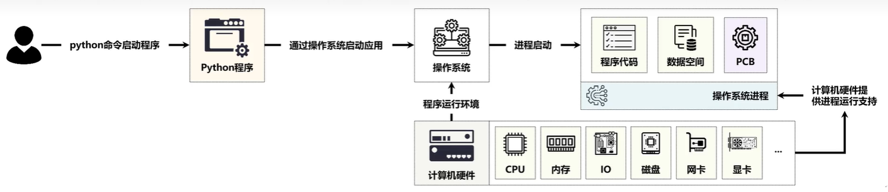
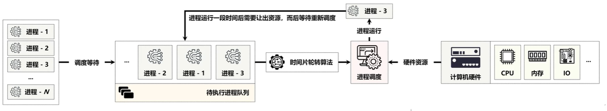
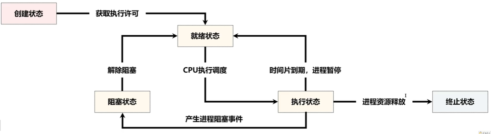

## 1 为什么使用并行编程

Python 在并发编程上所做出的设计是非常完善的，基本上包含有当前的各种主流模式，包括多进程、多线程和多协程的三种方式，并发编程的意义在于，提高程序的运行效率，充分的压硬件资源。

## 2 线程相关概念 

线程

## 2 进程相关概念 

### 2.1 进程

进程(Process)是计算机程序关于某数据集合上的一次运行活动，是正在运行的程序实例，是系统进行资源分配和调度的基本单元，是操作系统结构的基础。每当用户通过 python 命令启动一个 python 程序时，实际上对于操作系统来讲就相当于启动了一个系统进程，而后该进程内会保留有当前应用的程序代码、数据以及PCB(ProcessControl Block、进程控制块)信息



一个应用进程的执行，必然需要牵扯到 CPU 执行计算，也需要通过内存执行数据的存储(CPU需要的数据是从内存之中加载的)，而内存之中的数据可能是来自于磁盘上，也有可能来自于网络，但是最终网络的速度和磁盘的速度决定了内存数据的加载速度，而 CPU 的执行速度又取决于内存。

### 2.2 CPU时间片轮转算法

所有的进程在获取到某一个硬件资源的使用采用资源独享的方式，但是所有的进程由于是共享资源，因此从整体来讲硬件资源属于共享的状态，但是在多进程的执行之中，也会存在有一个问题，就是CPU 只有一块。因为所有进程的计算都需要 CPU 的支持，所以此时为了解决 CPU 资源的占用问题，在整个的操作系统里面提供了的多进程调度算法，例如:时间片轮转算法(每一个进程执行一段时间之后就结束吧，让其他的进程来执行)。



### 2.3 多核心CPU

现在都使用多核心的 CPU，这样有多个进程可以同时处理，因此电脑的执行速度就会变快。

```python
import multiprocessing

def main():
    print("The number of CPU cores is " + str(multiprocessing.cpu_count()))
	# The number of CPU cores is 16
if __name__ == '__main__':
    main()
```

### 2.4 进程生命周期和状态



* 创建状态：系统已为其分配了 PCB，但进程所需的程序上下文资源尚未分配，该进程不能够被调度;
* 就绪状态：进程已分配到除 CPU 意外的所有程序上下文资源，并等待CPU 调度;
* 执行状态：进程已获得 CPU，程序正在运行;
* 阻塞状态：正在执行的进程由于某些事件暂时无法继续执行时，放弃处理器而自行进入到阻塞状态;
* 终止状态：进程达到了自然结束或者是因为某些意外的原因被冻结


## 3 GIL 概念

### 3.1 GIL

GIL 全称 Global Interpreter Lock（全局解释器锁），是 Python 解释器 CPython 中的一个技术术语。

python 中一个线程对应 c 语言的一个线程， 为了安全，GIL 使得同一时刻只有一个线程在一个cpu上执行字节码。即使在多核处理器上，使用 Python 标准库中的线程模块，Python 程序也无法利用多线程实现真正的并行计算。


```python
"""
显示字节码
"""
import dis
def add(a):
	a = a + 1
	return a

print(dis.dis(add))
```

GIL 并不是在某个线程执行完后，再把锁交给下一个线程。而是按字节码行数和时间片进行释放 GIL
GIL 也会在遇到IO操作时，会主动释放。所以python比较适合IO编程时
```python
"""
如果是按线程，这里返回的total也是0
"""
from threading import Thread
total = 0
def add():
	global total
	for i in range(1000000):
		total += 1
def desc():
	global total
	for i in range(1000000):
		total -= 1
thread1 = Thread(target = add)
thread2 = Thread(target = desc)
thread1.start()
thread2.start()
thread1.join()
thread2.join()
print(total)
```

### 3.2 multiprocessing VS multithreading

Due to the presence[](存在) of the GIL (Global Interpreter Lock), when using multithreading, operations can only occur on a single CPU, preventing[](阻止) the use of multiple CPU capabilities.
Using multiprocessing allows you to take advantage of multiple CPUs for concurrent operations[](多核并发), improving execution efficiency:

- **Multi-CPU operations** should use multiprocessing (e.g., for computations, image processing).
- **I/O-bound operations** should use multithreading.
- The overhead of thread switching is significantly lower than that of process switching, so multithreading should be prioritized.


```python
from concurrent.futures import ThreadPoolExecutor, ProcessPoolExecutor, as_completed
import time
"""
Multi Thread exec for : 12.066435813903809
Multi Process exec for : 8.564054250717163
    Multi-CPU operations  multiprocessing is better than multithreading
"""
def fib(n):      
    if n <= 2:
        return 1
    return fib(n - 1) + fib(n - 2)

def main():
    with ThreadPoolExecutor(max_workers = 3) as exec:
        start_time = time.time()
        # all_thread_task = [exec.submit(fn = fib, args = (i,)) for i in range(25, 35)] # TypeError: ThreadPoolExecutor.submit() missing 1 required positional argument: 'fn'
        all_thread_task = [exec.submit(fib, i) for i in range(25, 40)]
        for future in as_completed(all_thread_task):
            print(f"exec thread result is : {future.result()}")
        print(f"Multi Thread exec for : {time.time() - start_time} ")

    with ProcessPoolExecutor(max_workers = 3) as exec:
        start_time = time.time()
        all_process_task = [exec.submit(fib, i) for i in range(25, 40)]
        for future in as_completed(all_process_task):
            print(f"exec process result is : {future.result()}")
        print(f"Multi Process exec for : {time.time() - start_time} ")

if __name__ == '__main__':
    main()

```

## 4 协程和异步io概念

### 4.1 基本概念

**并发和并行**
* 并发：一个时间段内，多个程序在一个cpu上运行(时间片轮转)，但是在任意时刻，只有一个程序运行
* 并行：一个时间点上，多个程序在多个CPU上运行。如果CPU核数是4，那么最多的并行数就是4

**同步和异步**
* 只有涉及到IO操作时，才会出现同步和异步情况
* 同步：调用IO操作时，等待IO操作完成并返回后，再执行其他操作
* 异步：调用IO操作时，不用等待IO操作完成，就直接返回再继续其他操作。

**阻塞和非阻塞**
* 阻塞 ：调用函数时，所属线程被挂起，CPU资源被拿走，无法继续执行。
* 非阻塞：调用函数时，所属线程没被挂起。

