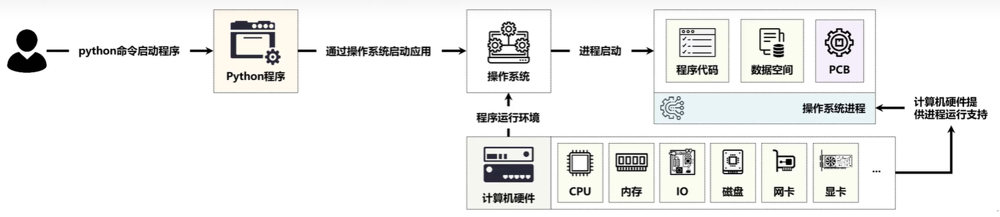
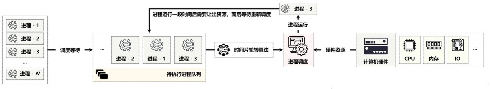

## 1 为什么使用并行编程

Python 在并发编程上所做出的设计是非常完善的，基本上包含有当前的各种主流模式，包括多进程、多线程和多协程的三种方式，并发编程的意义在于，提高程序的运行效率，充分的压硬件资源。

## 2 基本概念 

### 2.1 进程

进程(Process)是计算机程序关于某数据集合上的一次运行活动，是正在运行的程序实例，是系统进行资源分配和调度的基本单元，是操作系统结构的基础。每当用户通过 python 命令启动一个 python 程序时，实际上对于操作系统来讲就相当于启动了一个系统进程，而后该进程内会保留有当前应用的程序代码、数据以及PCB(ProcessControl Block、进程控制块)信息



一个应用进程的执行，必然需要牵扯到 CPU 执行计算，也需要通过内存执行数据的存储(CPU需要的数据是从内存之中加载的)，而内存之中的数据可能是来自于磁盘上，也有可能来自于网络，但是最终网络的速度和磁盘的速度决定了内存数据的加载速度，而 CPU 的执行速度又取决于内存。

所有的进程在获取到某一个硬件资源的使用采用资源独享的方式，但是所有的进程由于是共享资源，因此从整体来讲硬件资源属于共享的状态，但是在多进程的执行之中，也会存在有一个问题，就是CPU 只有一块。因为所有进程的计算都需要 CPU 的支持，所以此时为了解决 CPU 资源的占用问题，在整个的操作系统里面提供了的多进程调度算法，例如:时间片轮转算法(每一个进程执行一段时间之后就结束吧，让其他的进程来执行)。



为了进一步提高CPU的执行效率，所以现在都使用多核心的 CPU，这样有多个进程可以同时处理，因此电脑的执行速度就会变快。
```python

```