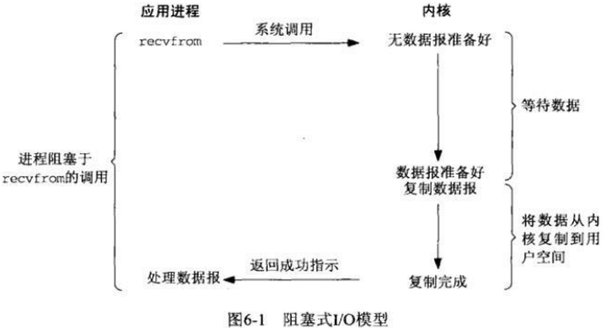
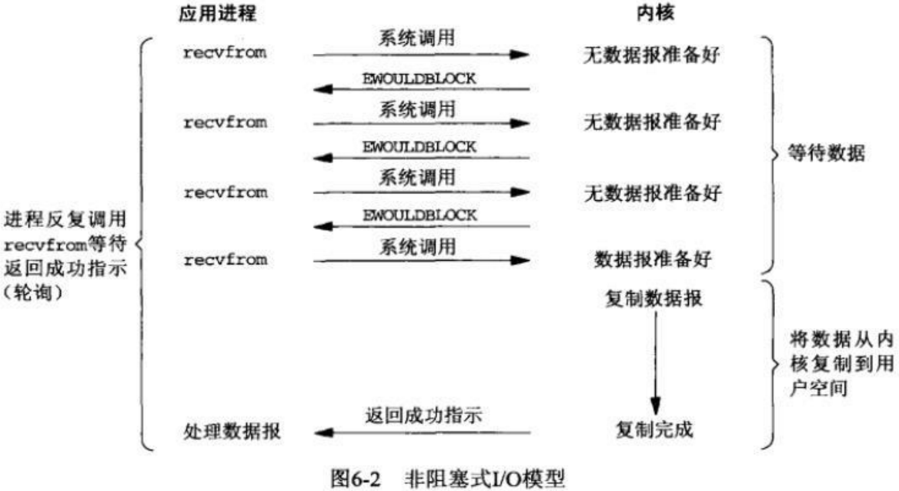
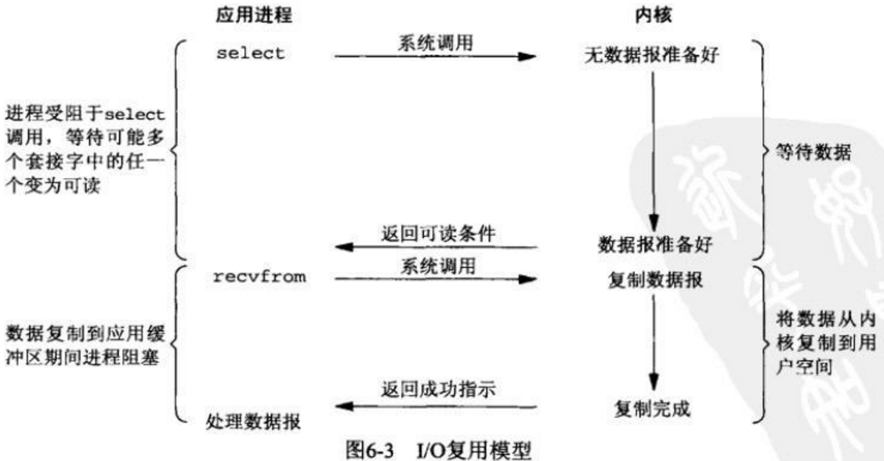
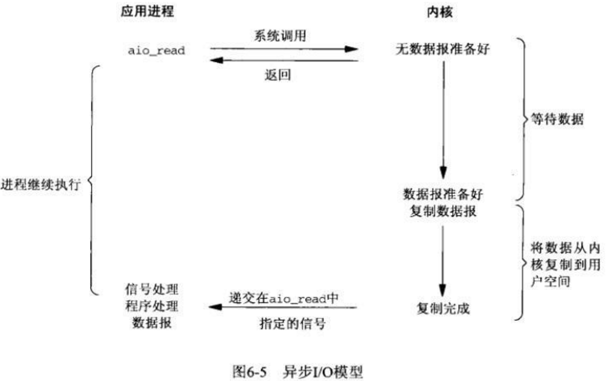

## 1 asyncio Desciption

### 1.1 Unix下的五种IO模型

> A synchronous I/O operation causes the requesting process to be blocked until that I/O operation completes;
> An asynchronous I/O operation does not cause the requesting process to be blocked;

- 同步模型 synchronous IO
    - 阻塞 IO-bloking IO
    - 非阻塞 IO-non-blocking IO
    - 多路复用IO multiplexing IO
    - 信号驱动式IO signal-driven IO
- 异步IO asynchronous IO

#### 阻塞IO

在linux中默认情况下所有的socket都是blocking的。
这个IO模型中，用户空间的应用程序执行一个系统调用（recvform)这会导致应用程序阻塞，直到数据准备好，然后将数据从内核复制到用户进程，最后进程再处理数据，在等待数据到处理数据的两个阶段，整个进程都被阻塞。不能处理别的网络IO。

#### 非阻塞 IO

在linux下，可以通过设置socket使其变为non-blocking。
非阻塞IO要求socket被设置为NONBLOCK，当用户进程发出read操作时，如果kernel中的数据还没有准备好，那么它并不会block用户进程，而是立刻返回一个error。从用户进程角度讲 ，它发起一个read操作后并不需要等待，而是马上就得到了一个结果。
用户进程判断结果是一个error时，它就知道数据还没有准备好，于是它可以再次发送read操作。一旦kernel中的数据准备好了，并且又再次收到了用户进程的system call，那么它马上就将数据拷贝到了用户内存，然后返回。
所以，用户进程第一个阶段不是阻塞的,需要不断的主动询问kernel数据好了没有；第二个阶段依然总是阻塞的。

#### IO多路复用(用的最多)

技术很稳定，AIO虽然最新但是提升并不多
IO multiplexing 就是我们说的select，poll，epoll，也称为event driven IO。[select，poll，epoll 都是IO多路复用的机制](https://www.bilibili.com/video/BV11P41157UQ?t=1178.3&p=68)。
* 并发高的情况下，连接活跃度不是很高： epoll比select好
* 并发性不高，连接活跃度很高：select比 epoll好
Java中NIO使用的就是该模型，也就是使用的Linux的epoll库。

循环查询多个任务的完成状态，只要有任何一个任务完成，就去处理它。UNIX/Linux 下的 select、poll、epoll 就是干这个的（epoll 比 poll、select 效率高，做的事情是一样的）。这就是所谓的 “IO 多路复用”。
select调用是内核级别的，select轮询能实现**同时对多个IO端口进行监听(与非阻塞IO的区别)**，当其中任何一个socket的数据准好了，就能返回进行可读，然后进程再进行recvform系统调用，将数据由内核拷贝到用户进程，当然这个过程是阻塞的。所以IO多路复用是阻塞在select，epoll这样的系统调用之上，而没有阻塞在真正的I/O系统调用如recvfrom之上。

**如果处理的连接数不是很高的话，使用select/epoll的web server不一定比使用multi-threading + blocking IO的web server性能更好，可能延迟还更大。select/epoll的优势并不是对于单个连接能处理得更快，而是在于能处理更多的连接。**

I/O多路复用的主要应用场景如下：  
服务器需要同时处理多个处于监听状态或者多个连接状态的套接字。  
服务器需要同时处理多种网络协议的套接字。

#### 异步非阻塞 IO

用户进程进行aio_read系统调用之后，无论内核数据是否准备好，都会直接返回给用户进程，然后用户态进程可以去做别的事情。等到socket数据准备好了，内核直接复制数据给进程，然后从内核向进程发送通知。IO两个阶段，进程都是非阻塞的。Linux提供了AIO库函数实现异步，但是用的很少。目前有很多开源的异步IO库，例如libevent、libev、libuv。异步过程如下图所示：

### 1.2 I/O Multiplexing Comparison

1.3 